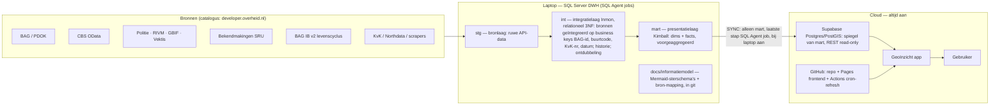

# GeoInzicht — architectuur (vastgelegd 02-08-2026)

> Plaatje: `docs/architectuur.svg`. Dit document is de bron; beheer via git (branch develop, merge naar main).

## Kern in één zin
Het DWH draait volledig op de laptop (SQL Server); alleen de presentatielaag (Kimball-marts) wordt gesynct naar Supabase, zodat de app blijft werken als de laptop uitstaat; GitHub levert code, informatiemodel, Pages-hosting en geplande refresh via Actions; developer.overheid.nl is de bronnencatalogus.

## Lagen

## Principes
1. Ruwe data (`stg`) en integratielaag (`int`) verlaten de laptop nooit; alleen gepubliceerde marts staan online.
2. `int` is een relationeel EDW in 3NF (Inmon): bronnen geïntegreerd op gedeelde business keys (BAG-identificatie, buurt-/wijk-/gemeentecode, KvK-nummer, datum), met historie en ontdubbeling. Relationeel model: `docs/informatiemodel/relationeel_model_integratielaag.md`. Besluit 02-08-2026: geen volledige Data Vault; wel DV-stijl laad-metadata (`geladen_op`, `bron`) op elke int-tabel; migratiepad naar DV blijft open via de business keys.
3. `mart` bestaat uit dependent data marts volgens Kimball, afgeleid uit `int`: sterschema's per onderwerpgebied (dim_buurt, dim_wijk, dim_gemeente, dim_datum, dim_gebruiksdoel; fact_bag_status, fact_criminaliteit, fact_woz, ...), voorgejoind en voorgeaggregeerd voor performance.
4. Sync = laatste stap van de SQL Agent-job: truncate+insert (later incrementeel) van `mart` naar Supabase. Laptop aan = sync; laptop uit = cloud draait door op laatste stand.
5. API-keys (o.a. BAG IB: `E:\scripts\webscraper\apibag.txt`) blijven server-side, nooit in het repo of index.html.
6. **Informatiemodel wordt beheerd in git**: map `docs/informatiemodel/` in het DWH-repo, per ster één markdown met Mermaid-ERD, kolomdefinities en bron-mapping (bron-API → int → dim/fact). Wijzigen = commit op develop, mergen naar main; GitHub rendert de diagrammen. Later te vervangen/aanvullen door dbt (docs + lineage + tests), met de laptop-database en Supabase als twee targets van hetzelfde model.
7. developer.overheid.nl = menukaart van bron-API's; per bron in catalog.json een link naar de officiële documentatie.
8. Frontend: GitHub Pages (branch main); lokaal serve.py met extra endpoints (/api/bag/lvc, /api/bekendmakingen); Pages-versie valt terug op BAG Viewer-links en de bekendmakingen-zoekpagina, later op Supabase Edge Functions.
9. **Besluit 02-08-2026 — één architectuur, meerdere domeinen en projecten.** Alle prototypes (GeoInzicht, DAW, astronomie, …) draaien op ditzelfde DWH. `int` is ingedeeld per datadomein (geo, bedrijf, audio, astronomie), elk met een eigen kernobject; er is géén universeel kernobject en dat wordt niet geforceerd — koppelen alleen op gedeelde business keys (adres, gebied, kvk_nr, datum). `mart` is ingedeeld per project: eigen sterren per prototype (naamconventie `ster_<project>_<onderwerp>.md`), met conformed dimensions (dim_datum, dim_adres, dim_gebied, dim_bedrijf). Losse datasets eerst alleen registreren in de catalogus (bron, peildatum, licentie); pas modelleren bij structureel gebruik. Zie `docs/informatiemodel/OVERZICHT.md`.

## App-features (stand 02-08-2026)
BAG-status prominent in tooltip (badge) en popup (klikbare banner → BAG Viewer levenscyclus & brondocument); levenscyclus-tijdlijn via /api/bag/lvc (documentnummer + -datum = brondocument, besluit opvragen bij gemeente, evt. Woo); bekendmakingen-knop voor ieder adres via SRU/KOOP.
