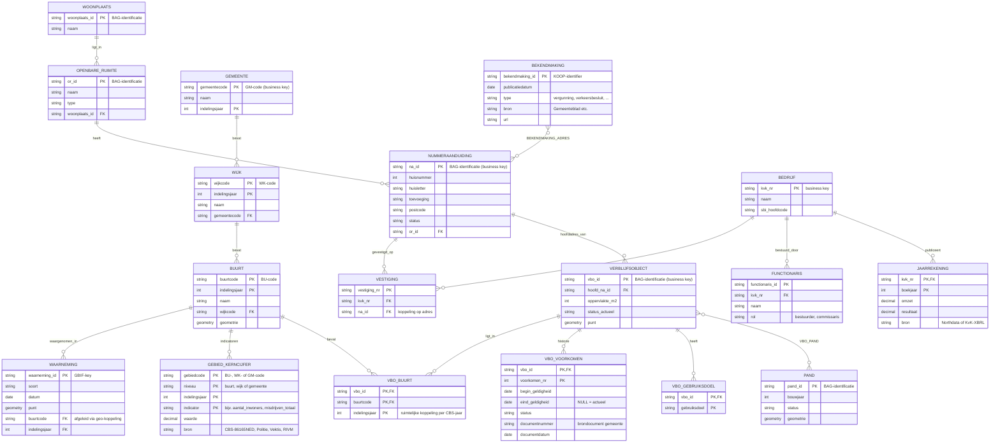

# Relationeel model — integratielaag (int) — Inmon

> Informatiemodel GeoInzicht DWH, klassieke Inmon-architectuur: de **integratielaag is een relationeel EDW in 3NF** (entiteiten met eigen sleutels, relaties via foreign keys, historie in aparte tabellen), waaruit **dependent data marts volgens Kimball** worden afgeleid in de presentatielaag (`mart`, zie `ster_bag_status.md`). Beheer via git: wijzigen = commit op develop.

## ERD (kern: BAG + CBS-gebieden + KvK + bekendmakingen)



## Modelleerprincipes

0. **Besluit (02-08-2026): int = Inmon 3NF met Data Vault-stijl laad-metadata; geen volledige Data Vault.** Elke int-tabel krijgt twee standaardkolommen: `geladen_op` (datetime van de laadrun) en `bron` (record source, bijv. 'PDOK-BAG' of 'CBS-86165NED'). Dat geeft de audit-trail en herleidbaarheid van DV zonder de hub/link/satellite-overhead. Heroverwegen zodra er veel bewegelijke bronnen of meerdere ontwikkelaars bijkomen; de business keys zijn dan de hubs, koppeltabellen de links, historietabellen de satellites — migratiepad blijft open.

1. **Business keys uit de bron**: BAG-identificaties, BU/WK/GM-codes, KvK-nummer. Surrogaatsleutels komen pas in de marts (dim-keys).
2. **Historie relationeel**: `VBO_VOORKOMEN` bevat de volledige levenscyclus per verblijfsobject, inclusief `documentnummer`/`documentdatum` (het brondocument, op te vragen bij de gemeente). Zelfde patroon toepasbaar op PAND en NUMMERAANDUIDING zodra nodig.
3. **CBS-jaarversies**: gebieden zijn per indelingsjaar uniek (buurtgrenzen wijzigen); daarom `indelingsjaar` in de sleutel en in de koppel `VBO_BUURT`.
4. **Integratie op adres**: KvK-vestigingen en bekendmakingen koppelen op `NUMMERAANDUIDING` (na_id); zo komen alle bronnen op hetzelfde adresbegrip samen.
5. **`GEBIED_KERNCIJFER` als EAV** (gebied × niveau × jaar × indicator → waarde): één tabel voor álle gebiedsstatistieken (CBS, politie, Vektis-zorgkosten, RIVM), met `niveau` expliciet in de sleutel. Een bron die alleen op gemeenteniveau levert (Vektis) staat er dus op niveau 'gemeente' in en wordt nooit stilzwijgend naar buurten verdeeld: datakwaliteit boven schijnprecisie. De marts draaien dit naar kolommen waar dat handig is.
6. **Twee ankers, één brug (aansluitprincipe).** Alle bronnen haken aan op één van twee kernobjecten: het **ADRES-anker** (NUMMERAANDUIDING/VERBLIJFSOBJECT) voor objectbronnen (BAG, KvK-vestigingen, bekendmakingen, later WOZ) en het **GEBIED-anker** (BUURT/WIJK/GEMEENTE per indelingsjaar) voor statistiekbronnen (CBS, politie, Vektis, RIVM). De brug tussen beide is `VBO_BUURT` (geo-koppeling per indelingsjaar). Puntbronnen zoals GBIF-waarnemingen krijgen hun gebiedskoppeling via geometrie. Bronnen zonder adres of gebied (Rechtspraak Open Data, KNMI) koppelen hooguit op gemeente of blijven een los domein; dat wordt per bron expliciet vastgelegd en nooit geforceerd.
7. **Afleiding naar mart**: sterren (bijv. `ster_bag_status.md`) worden volledig uit dit model gevuld; niets in mart dat niet uit int herleidbaar is (lineage).
```
int (relationeel, 3NF, historie)  ──afleiding──▶  mart (Kimball, sterren)  ──sync──▶  Supabase
```
