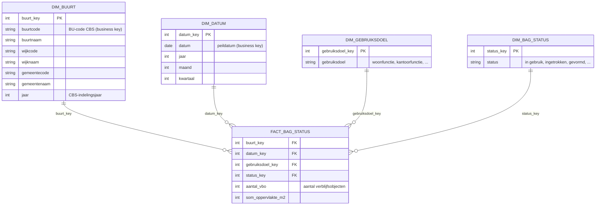

# Ster: BAG-status per buurt (eerste datamart)

> Informatiemodel GeoInzicht DWH · beheer in git (`docs/informatiemodel/`) · wijzigingen via commits op develop.
> GitHub rendert het onderstaande Mermaid-diagram automatisch. Lokaal renderen: zie "Mermaid inzetten" onderaan.

## Sterschema



## Bron-mapping (bron → int → mart)

| Bron (developer.overheid.nl) | stg | int (business key) | mart |
|---|---|---|---|
| PDOK BAG verblijfsobjecten | stg.bag_vbo | int.verblijfsobject (BAG-identificatie; historie per voorkomen) | fact_bag_status (aggregatie per buurt × status × gebruiksdoel × peildatum) |
| CBS gebiedsindelingen (PDOK WFS) | stg.cbs_buurten | int.gebied (buurtcode; jaarversies) | dim_buurt |
| — (gegenereerd) | — | — | dim_datum, dim_bag_status, dim_gebruiksdoel |

**Korrel feit:** één rij = buurt × peildatum × BAG-status × gebruiksdoel. Volledig additief.
**Sync:** alleen dit mart-schema gaat naar Supabase (truncate + insert, laatste stap SQL Agent-job).

## Mermaid inzetten

1. **GitHub (aanrader, nul werk):** een codeblok met taal `mermaid` in een .md-bestand rendert GitHub automatisch als diagram, ook in README's en PR's. Dit bestand is er zelf het bewijs van na de push.
2. **Eigen websites (dataconsultants / geoinzicht):** één script-tag en een class:
   ```html
   <script type="module">
     import mermaid from 'https://cdn.jsdelivr.net/npm/mermaid@11/dist/mermaid.esm.min.mjs';
     mermaid.initialize({ startOnLoad: true, theme: 'dark' });
   </script>
   <pre class="mermaid">
   erDiagram
     DIM_BUURT ||--o{ FACT_BAG_STATUS : buurt_key
   </pre>
   ```
3. **Los ontwerpen/exporteren:** mermaid.live (online editor, exporteert SVG/PNG).
4. **VS Code:** extensie "Markdown Preview Mermaid Support" toont de diagrammen in de preview.
